# 

## 🚀프로젝트 명 : AniBirth(애니버스)
- 웹 URL : www.anibirth.shop, localhost:8040
- DB PORT : 3306
- DB username : root
- 데이터베이스 이름 : anibirth_dev

## 📢 프로젝트 목표
- 유기동물의 삶의 질 개선 및 입양률 상승
- 후원을 통한 유기동물 보호소에 대한 관심도 상승과 지원 강화
- 유기동물 봉사를 통한 유기동물들의 건강과 복지 증진
- 유기동물 문제에 대한 인식 높이기

## ⏱️개발 기간
- 전체 개발 기간 : 2024-07-15 ~ 2024-09-02
- 프로젝트 주제 선정 기간 : 2024-07-15 ~ 2024-07-19
- UI 구현 : 2024-07-20 ~ 2024-09-02
- 기능 구현 : 2024-07-20 ~ 2024-09-02

## ⚙ 개발 환경
- 운영체제 : Windows 11
- 통합개발환경(IDE) : IntelliJ
- JDK 버전 : JDK 17
- 데이터 베이스 : MySQL
- 빌드 툴 : Gradle
- 관리 툴 : GitHub


## 🔌 Dependencies
- Spring Boot DevTools
- Lombok
- Spring Data JPA
- MariaDB Driver
- Spring Security
- Spring Web
- Oauth2-client
- Thymeleaf
- Validation
- Jackson (공공데이터 OpenAPI)
- Toss Payments
- FullCalendar
- Kakao Maps


## 💻 기술 스택
- 백엔드
    - SpringBoot, Spring Security, Spring Data JPA
- 프론트엔드
    - HTML, CSS, Javascript, Bootstrap, Thymeleaf, jQuery, Tailwind
- 데이터베이스
    - MariaDB, MySQL Workbench
    - MySQL, SQLyog, DBeaver

## 🛠 DB 테이블 설계
- Member (회원)
- account (계좌)
- adopt (입양)
- adoptApply (입양신청)
- adoptReview (입양후기)
- animal (유기동물)
- article (공지사항)
- calendar (캘린더)
- cartItem (장바구니)
- category (동물 카테고리)
- donation (후원)
- member_applied_volunteers (봉사 신청 회원)
- orderItem (주문)
- product (상품)
- product_order (결제내역)
- qa (게시판 질문사항)
- qa_admin_comments (게시판 답변)
- qa_comment_authors (게시판 댓글 작성자)
- review (상품 리뷰)
- volunteer (봉사활동)
- volunteer_application (봉사활동 신청 회원)
- volunteer_review (봉사활동 후기)
- volunteer_review_sub_images (봉사활동 후기 첨부 사진)

<br>

| E-R 다이어그램                                                     |
|---------------------------------------------------------------|
|  |

<br>

## 👨‍👩‍👧‍👦 조원 소개

<div align="center">

|                                                           **박상민 (조장)**                                                            |                                                               **김지영**                                                                |                                                             **김태우**                                                              |                                                                **박현철**                                                                |
|:---------------------------------------------------------------------------------------------------------------------------------:|:------------------------------------------------------------------------------------------------------------------------------------:|:--------------------------------------------------------------------------------------------------------------------------------:|:-------------------------------------------------------------------------------------------------------------------------------------:|
| [ <br/> @psm817](https://github.com/psm817) | [ <br/> @jiyoung-0y0](https://github.com/jiyoung-0y0) | [ <br/> @taewoo922](https://github.com/taewoo922) | [ <br/> @2251341](https://github.com/2251341) |

</div>

## 🧑‍🏫 역할 분담

### 🍋‍🟩 박상민 (조장)

- **UI**
  - 페이지 : 메인페이지, 로그인, 회원가입, 마이페이지, 봉사활동, 애니마켓
- **기능**
  1. 서버 배포
     - 네이버 클라우드 플랫폼을 이용하여 서버 생성
     - Docker 이미지 생성을 통해 서버 배포 완료
     - 젠킨스를 통한 CI/CD 배포 자동화 세팅
  2. 회원 (로그인, 회원가입, 마이페이지)
     - 일반 회원 및 카카오, 네이버, 구글을 통한 소셜 로그인 구현
     - 아이디 찾기, 임시 비밀번호 발급 구현 (이메일 발송)
     - 회원가입 구현
     - 마이페이지를 통한 회원 정보 열람, 프로필 수정, 회원 탈퇴 구현
  3. 메인페이지
     - 봉사활동 요약 기능 구현
     - 유기동물 공고 요약 기능 구현
     - 애니마켓 베스트 상품 요약 기능 구현
     - 공지사항, 봉사후기, 입양후기, 바로가기 버튼 구현
  4. 봉사활동
     - 봉사활동 등록, 수정, 삭제 구현
     - 봉사활동 전체 리스트와 상세보기 구현
     - 봉사활동 상세보기 중 봉사 장소에 대한 지도 표시 구현
     - 봉사활동 신청 구현
     - 등록된 각각의 봉사활동을 캘린더에 표시되도록 구현
     - 봉사활동 후기 등록, 수정, 삭제 구현
  5. 애니마켓
     - 마켓 상품 등록, 수정, 삭제 구현
     - 마켓 상품에 대한 리뷰 등록, 수정, 삭제 구현
     - 마켓 상품 전체 리스트와 상세보기 구현
     - 마켓 내 카테고리 구분 (식료품, 액세서리)
     - 신상품순, 높은(낮은)가격순, 별점순, 조회순으로 리스트 구현
<br>

### 🐶 김지영

- **UI**
  - 페이지 : 공지사항, Q&A, 회사소개, 애니마켓
- **기능**
  1. 공지사항
        - 인증된 사용자는 새로운 공지사항을 생성, 생성된 공지사항은 목록에 표시
        - 모든 사용자는 페이징 기능이 적용된 공지사항 목록을 조회
        - 개별 공지사항의 상세 내용 확인, 조회수는 자동으로 증가
        - 관리자 권한을 가진 공지사항 작성자는 기존 공지사항을 수정, 삭제 가능
        - 공지사항 목록은 페이지별로 나누어 표시, 이전/다음 페이지로 이동
  2. Q&A
        - 모든 사용자는 페이징 기능이 적용된 Q&A 목록 조회
        - 개별 Q&A의 상세 내용 확인, 조회수는 자동으로 증가
        - 작성자나 관리자 권한을 가진 사용자는 기존 Q&A 수정, 삭제 가능
        - Q&A 목록은 페이지별로 나누어 표시, 이전/다음 페이지로 이동 기능
        - 관리자, 중간관리자는 Q&A 댓글 추가, 자신의 댓글을 삭제 가능
        - 댓글 작성 후, 댓글이 포함된 페이지로 자동 스크롤 이동
        - Q&A 상세 페이지에서 이전, 목록, 다음 페이지 이동
  3. 애니마켓
       - 모든 상품의 목록을 조회하여 화면에 표시, 특정 상품의 상세 정보를 조회
       - 새로운 상품을 생성하여 데이터베이스에 저장
       - 상품의 이미지를 목록과 상세 페이지에 표시
       - 각 상품의 등록 날짜와 수정 날짜를 화면에 표시 
  4. 회사소개 
       - 자동 재생과 내비게이션 버튼을 갖춘 슬라이드쇼 구현
       - 스크롤 시 특정 요소에 애니메이션 효과를 추가
       - 마우스 오버 시 하위 메뉴가 슬라이드 다운, 마우스 아웃 시 슬라이드 업
      
<br>

### 🚌 김태우

- **UI**
  - 페이지 : 입양하기, 입양절차, 입양후기, 입양공고작성
- **기능**
  1. 입양정보
     - 공공데이터 API를 활용해서 대전지역내 유기동물 정보 활용
     - 카테고리 기능을 활용해 동물의 정보를 각 조건에 맞게 검색
     - 유기동물 전체 리스트 및 상세보기
     - 유기동물을 클릭 후 입양신청 기능 구현
  2. 입양후기
     - toast ui 활용한 작성기능
     - 입양후기 작성 및 수정, 삭제 기능
     - 후기 작성 및 수정, 삭제시 알림기능
  3. 입양공고 작성 
     - 입양공고 등록
     - 입양공고 작성 후 알림기능
  4. 입양절차
     - 메뉴에서 입양절차 클릭시 화면 이동 기능
     
<br>

### 👑 박현철

- **UI**
    - 페이지 : 후원하기, 공지사항, Q&A(반응형), 애니마켓, 장바구니, 주문 결제, 포인트 충전
- **기능**
    1. 후원
        - 중간관리자 및 최고관리자에게 후원하기 기능
        - 상위 후원자 3순위 리스트 기능 구현
        - 후원하기 기능 사용 시 애니포인트 차감 
    2. 마켓
        - 마켓 상품 수정, 삭제 기능 구현
        - 리뷰(별점) 등록 기능 구현
        - 상품 상세 보기 기능 구현
        - 장바구니 담기 기능 구현
        - 상품 결제 시 상품 등록한 기업 관리자에게 포인트 적립 기능 구현
    3. 장바구니
        - 장바구니 기능 구현(이미지, 상품명, 가격, 수량)
        - 체크박스 기능 구현
        - 수량 변경 기능 구현
        - 수량 변경 or 체크박스 부분 선택 시 총 가격 자동 업데이트
    4. 주문 결제
       - 주문 상품 목록, 배송지 정보, 결제 가격 구현
       - 배송지 정보(받는사람, 주소, 전화번호)
       - 결제 가겨(상품 가격, 배송비, 합계)
       - 결제 시 포인트 차감 기능 구현
    5. 포인트 충전
       - 1,000원/5,000원/10,000원/50,000원/100,000원 단위로 포인트 충전 기능 구현
       - 직접 입력으로 포인트 충전 기능 구현
    6. 결제 기능(토스페이먼트)
        - TossPayments API 결제 연동
        - 포인트 충전 결제
    7. 마이페이지(후원/마켓)
        - 후원 리스트 기능 구현(권한별 리스트 항목 구분)
            - 일반 회원 - 로그인 한 회원의 후원 내역
            - 중간 관리자 - 본기업의 후원 받은 내역
            - 최고 관리자 - 후원내역 전체 리스트
        - 마켓 리스트 기능 구현(권한별 리스트 항목 구분)
          - 일반 회원 - 로그인 한 회원의 구매 내역
          - 중간 관리자 - 본기업의 상품 등록 내역
          - 최고 관리자 - 등록된 상품의 전체 리스트

<br>

## 📝 프로젝트 전체 구조

```
├── README.md
├── build.gradle
├── .gitignore
├── gradlew.bat
├── gradlew
│
└── src.main
     ├── java.com.cod.AniBirth
           ├── AniBirthApplication.java
           ├── AniBirth
                  ├── account
                          ├── entity.Account.java
                          ├── repository.AccountRepository.java
                          ├── service.AccountService.java
                  ├── adopt
                        ├── controller.AdoptController.java
                        ├── entity
                               ├── Adopt.java
                               ├── AdoptApply.java
                               ├── AdoptReview.java
                        ├── form
                              ├── AdoptForm.java
                              ├── AdoptionnoticeForm.java
                              ├── createReviewForm.java
                        ├── repository
                                 ├── AdoptApplyRepository.java
                                 ├── AdoptRepository.java
                                 ├── AdoptReviewRepository.java
                        ├── service
                                ├── AdoptReviewService.java
                                ├── AdoptService.java
                  ├── animal
                        ├── contorller.AnimalController.java
                        ├── entity.Animal.java
                        ├── repository.AnimalRepository.java
                        ├── service.AnimalService.java
                        ├── AnimalSearchDTO.java
                        ├── AnimalSpecification.java
                  ├── article
                        ├── contorller.ArticleController.java
                        ├── contorller.QaController.java
                        ├── entity.Article.java
                        ├── entity.Qa.java
                        ├── repository.ArticleRepository.java
                        ├── repository.QaRepository.java
                        ├── service.ArticleService.java
                        ├── service.QaService.java
                  ├── base
                        ├── entity.BaseEntity.java
                        ├── WebMvcConfig.java
                  ├── calendar
                        ├── contorller.CalendarController.java
                        ├── entity.Calendar.java
                        ├── repository.CalendarRepository.java
                        ├── service.CalendarService.java
                  ├── cart
                        ├── contorller.CartController.java
                        ├── entity.CartItem.java
                        ├── repository.CartRepository.java
                        ├── service.CartService.java
                  ├── category
                        ├── contorller.CategoryController.java
                        ├── entity.Category.java
                        ├── repository.CategoryRepository.java
                        ├── service.CategoryService.java
                        ├── CategoryInitializer.java
                  ├── donation
                        ├── contorller.DonationController.java
                        ├── entity.Donation.java
                        ├── repository.DonationRepository.java
                        ├── service.DonationService.java
                  ├── email
                        ├── service.EmailService.java
                  ├── global
                        ├── initData.Dev.java
                        ├── Message.Message.java
                        ├── security
                                ├── exception.MemberNotFoundException.java
                                ├── exception.OAuthTypeMatchNotFoundException.java
                                ├── CustomAuthenticationFailureHandler.java
                                ├── CustomUserDetailsService.java
                                ├── DataNotFoundException.java
                                ├── MemberContext.java
                                ├── OAuth2UserService.java
                                ├── SecurityConfig.java
                                ├── UserNotActiveException.java
                  ├── home
                        ├── contorller.HomeController.java
                        ├── contorller.IntroduceController.java
                  ├── member
                        ├── contorller.MemberController.java
                        ├── contorller.MyPageMemberController.java
                        ├── contorller.UsernameCheckController.java
                        ├── entity.Member.java
                        ├── form.MemberForm.java
                        ├── repository.MemberRepository.java
                        ├── service.MemberService.java
                  ├── order
                        ├── contorller.OrderController.java
                        ├── entity.Order.java
                        ├── entity.OrderItem.java
                        ├── repository.OrderItemRepository.java
                        ├── repository.OrderRepository.java
                        ├── service.OrderService.java
                  ├── point
                        ├── contorller.PointController.java
                        ├── service.PointService.java
                  ├── product
                        ├── contorller.ProductController.java
                        ├── entity.Product.java
                        ├── repository.ProductRepository.java
                        ├── service.ProductService.java
                  ├── review
                        ├── contorller.ReviewController.java
                        ├── entity.Review.java
                        ├── repository.ReviewRepository.java
                        ├── service.ReviewService.java
                  ├── volunteer
                        ├── contorller.VolunteerController.java
                        ├── entity.Volunteer.java
                        ├── entity.VolunteerApplication.java
                        ├── entity.VolunteerReview.java
                        ├── repository.VolunteerRepository.java
                        ├── repository.VolunteerApplicationRepository.java
                        ├── repository.VolunteerReviewRepository.java
                        ├── service.VolunteerService.java
                        ├── service.VolunteerApplicationService.java
                        ├── service.VolunteerReviewService.java
                  ├── ApiExploer.java
                  ├── ApiResponse.java
                  ├── XmlToJsonConverter.java
           ├── global
                  ├── util
                        ├── HtmlUtils.java
                        ├── Util.java
    ├── resource
            ├── static
                   ├── adopt
                          ├── 입양신청서폼.docx
                          ├── 카테고리.svg
                   ├── images
                          ├── 샘플데이터 사진 및 프로젝트 로고 사진
                   ├── javascript
                          ├── adopt
                                ├── zipcode.js
                          ├── article
                                ├── detail.js
                          ├── commont
                                ├── common.js
                          ├── donation
                                ├── donationscript.js
                          ├── home
                                ├── main.js
                          ├── member
                                ├── myProfile.js
                                ├── agreement.js
                                ├── login.js
                                ├── modify.js
                                ├── signup.js
                                ├── social_modify.js
                          ├── product
                                ├── create.js
                                ├── detail.js
                          ├── qa
                               ├── list.js
                          ├── volunteer
                                  ├── create.js
                                  ├── detail.js
                                  ├── list.js
                                  ├── reviewCreate.js
                   ├── resource
                         ├── adopt
                                ├── apply.css
                                ├── create_review.css
                                ├── detail.css
                                ├── list.css
                                ├── review.css
                                ├── review_detail.css
                         ├── article
                                ├── detail.css
                                ├── form.css
                                ├── list.css
                         ├── common
                                ├── common.css
                         ├── donation
                                ├── donationPage.css
                         ├── home
                               ├── main.css
                         ├── introduce
                                  ├── agreement.css
                         ├── member
                                ├── myPage
                                      ├── adopt.css
                                      ├── donation.css
                                      ├── market.css
                                      ├── myProfile.css
                                      ├── volunteer.css
                                ├── agreement.css
                                ├── login.css
                                ├── modify.css
                                ├── signup.css
                                ├── social_modify.css
                         ├── order
                               ├── checkout.css
                         ├── points
                                ├── recharge.css
                         ├── product
                                ├── accessory.css
                                ├── create.css
                                ├── detail.css
                                ├── food.css
                                ├── list.css
                                ├── main.css
                         ├── qa
                              ├── detail.css
                              ├── form.css
                              ├── list.css
                         ├── volunteer
                                  ├── create.css
                                  ├── detail.css
                                  ├── list.css
                                  ├── modify.css
                                  ├── review.css
                                  ├── reviewCreate.css
                                  ├── reviewDetail.css
                                  ├── reviewModify.css
            ├── templates
                    ├── adopt
                          ├── adoption_noticeForm.html
                          ├── create_review_form.html
                          ├── detail.html
                          ├── form.html
                          ├── list.html
                          ├── review.html
                          ├── review_detail.html
                    ├── article
                            ├── detail.html
                            ├── form.html
                            ├── list.html
                    ├── cart
                           ├── list.html
                    ├── donation
                           ├── donation.html
                    ├── home
                           ├── main.html
                    ├── introduce
                           ├── agreement.html
                           ├── anibirth.html
                    ├── layout
                          ├── layout.html
                    ├── member
                          ├── myPage
                                 ├── adopt.html
                                 ├── donation.html
                                 ├── market.html
                                 ├── myProfile.html
                                 ├── volunteer.html
                          ├── agreement.html
                          ├── login.html
                          ├── modify.html
                          ├── signup.html
                          ├── social_modify.html
                    ├── order
                          ├── checkout.html
                    ├── points
                          ├── recharge.html
                    ├── product
                          ├── accessory
                                  ├── high_hit.html
                                  ├── high_price.html
                                  ├── high_rating.html
                                  ├── low_price.html
                          ├── food
                                ├── high_hit.html
                                ├── high_price.html
                                ├── high_rating.html
                                ├── low_price.html
                          ├── list
                                ├── high_hit.html
                                ├── high_price.html
                                ├── high_rating.html
                                ├── low_price.html
                          ├── accessory.html
                          ├── create.html
                          ├── detail.html
                          ├── food.html
                          ├── list.html
                          ├── main.html
                          ├── modify.html
                    ├── qa
                         ├── detail.html
                         ├── form.html
                         ├── list.html
                    ├── review
                           ├── modify.html
                    ├── volunteer
                            ├── create.html
                            ├── detail.html
                            ├── list.html
                            ├── modify.html
                            ├── review.html
                            ├── reviewCreate.html
                            ├── reviewDetail.html
                            ├── reviewModify.html
                    ├── message.html
            ├── application.yml
            ├── application-dev.yml
            ├── application-prod.yml (배포용)
            ├── application-secret.yml (비공개)
            ├── application-secret.yml.default
            ├── application-test.yml (테스트용)
```

## 🧜‍♀️ 작업 관리 방법

- GitHub Projects와 Issues를 사용하여 진행 상황을 공유했습니다.
- 매일 본인의 작업 양을 소화하고 각자 구현한 기능을 서로 테스트하며 프로그램의 신뢰성을 높였습니다.

## ⭐ 페이지별 기능 소개

### [메인화면]
- 홈페이지 접속 시 초기화면으로 화면의 기본 구조는 상단 메뉴바, 중간 본문, 하단 footer로 구분되어 있습니다.
  - 상단 메뉴바는 애니버스, 봉사활동, 입양정보, 후원하기, 애니마켓, 애니공지로 총 6개의 메뉴로 구성되어 있습니다.
  - 상단 메뉴바의 최상단 부분은 로그인, 회원가입도 함께 포함되어 있습니다.
  - 중간 본문에는 광고 및 홍보 배너와 봉사활동, 입양공고, 마켓 Best 상품을 요약한 리스트가 나열되어 있습니다.
  - 추가로 공지사항, 봉사 및 입양 후기, 각 메뉴의 바로가기 버튼이 중간 본문에 포함되어 있습니다.
  - 각 요약된 정보 옆에는 전체보기를 통해 해당 메뉴 페이지로 이동이 가능합니다.
  - 하단 footer는 이용약관과 개인정보처리방침을 비롯한 애니버스의 기본 정보를 나타냅니다.
- 로그인과 미로그인 시 화면에 나타나는 메뉴가 상이합니다.
    - 로그인이 되어 있지 않은 경우 : 로그인, 회원가입
    - 로그인이 되어 있는 경우 : 마이페이지, 장바구니, 로그아웃

| 메인화면                                                         |
|--------------------------------------------------------------|
| 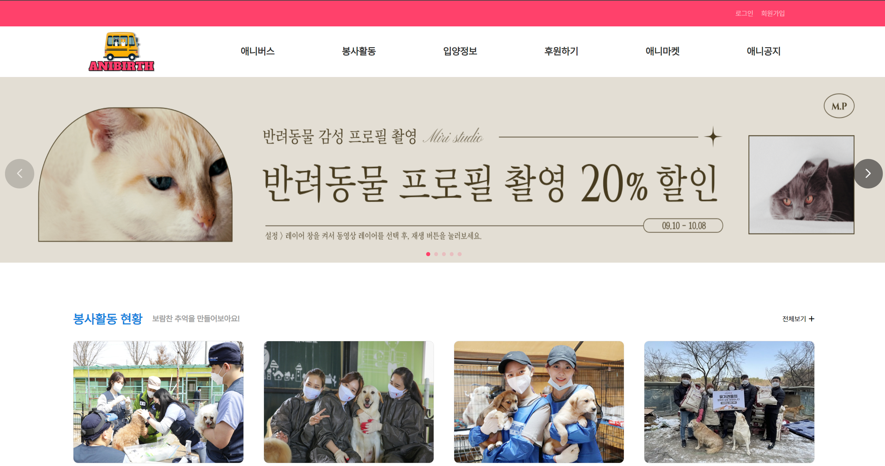 |

<br>

### [회원가입]
- 회원가입 버튼과 동시에 이용약관 및 개인정보 수집에 대한 동의서 제출이 요구됩니다.
- 약관 동의 후 일반 회원가입을 진행할 수 있습니다.
- 회원가입의 모든 항목에 대한 유효성 검사를 적용하여 입력하지 않으면 회원가입이 진행되지 않습니다.
- ID는 중복확인을 필수로, 비밀번호는 비밀번호 확인절차를 거칩니다.
- 회원의 권한은 크게 두 가지로, 회원가입 시 보호소/기업 또는 일반회원을 선택할 수 있습니다.
- 보호소/기업을 선택하여 회원가입을 진행할 시, 서비스를 바로 이용할 수 없으며 최고 관리자의 승인이 필요합니다.
- 회원가입이 완료되면 로그인 화면으로 이동과 동시에 회원가입 시 입력한 이메일 주소로 환영 메일이 전송됩니다.
- 최고 관리자의 승인을 받은 보호소/기업 권한의 회원 역시 승인과 동시에 입력한 이메일 주소로 승인완료 메일이 전송됩니다.

| 회원가입                                                          |
|---------------------------------------------------------------|
| 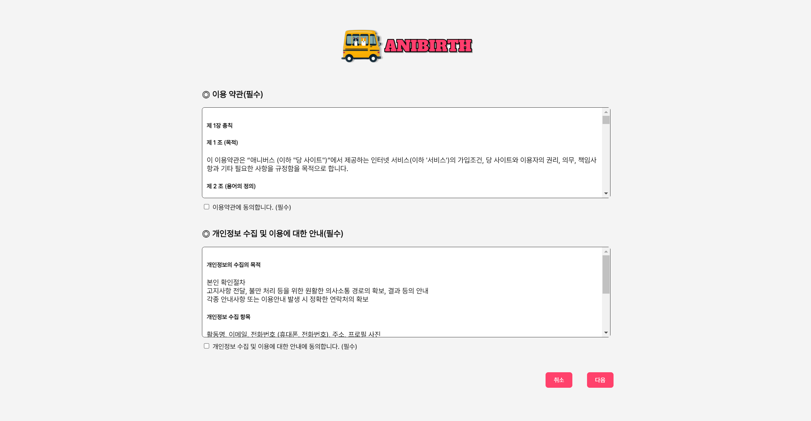 |
| 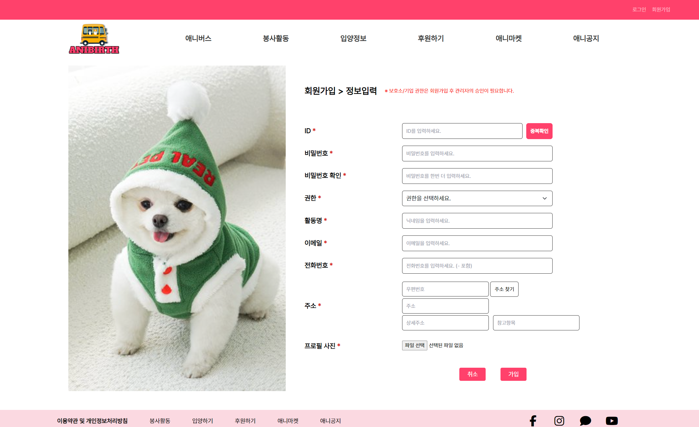 |

<br>

### [로그인]
- 회원가입을 통해 생성된 ID와 PW로 로그인을 수행합니다.
- 카카오, 네이버, 구글을 통한 소셜 로그인은 버튼을 눌러 각 플랫폼에 로그인하면 자동으로 계정 생성과 동시에 로그인을 수행합니다.
- 로그인에 성공하면 메인화면으로 이동합니다.

| 로그인                                                          |
|--------------------------------------------------------------|
|  |

<br>

### [아이디 찾기, 임시비밀번호 발급]
- 아이디 찾기 버튼을 통해 회원가입 시 입력한 이메일 주소를 입력하고 찾기 버튼을 누르면 해당 회원의 아이디를 보여줍니다.
- 임시비밀번호 발급 버튼을 통해 회원가입 시 입력한 아이디와 이메일 주소를 입력하면 해당 이메일 주소로 임시비밀번호가 전송됩니다.
- 임시비밀번호를 발급받은 회원은 기존의 비밀번호가 아닌 발급받은 임시비밀번호를 통해서만 로그인이 가능합니다.

| 아이디 찾기, 임시비밀번호 발급                                               |
|-----------------------------------------------------------------|
| 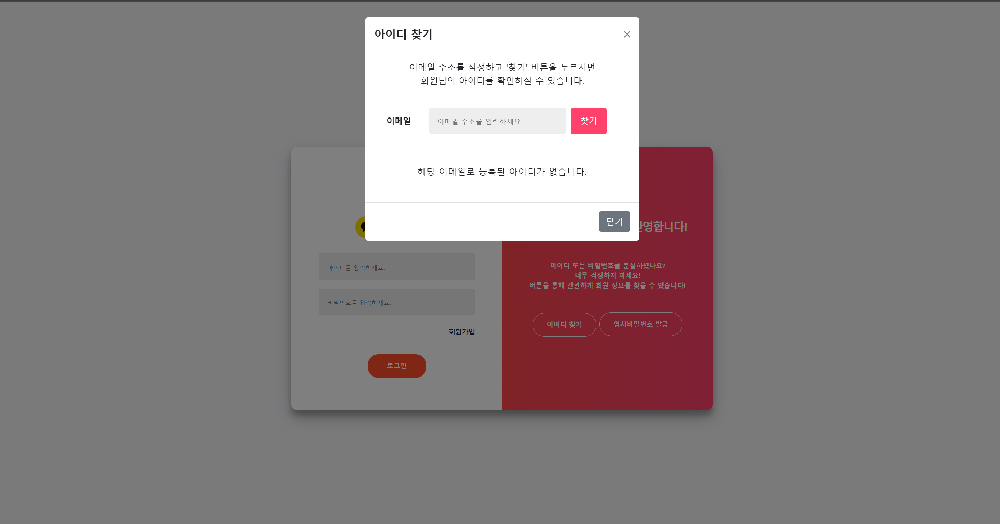  |
| 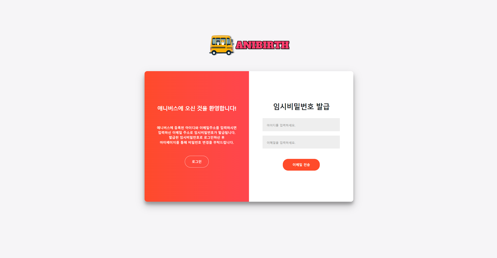 |

<br>

### [마이페이지]
- 로그인이 되어있는 사용자만 마이페이지에 진입할 수 있습니다.
- 마이페이지 내 메뉴는 마이프로필(회원목록), 봉사내역, 입양내역, 후원 및 마켓내역으로 총 4가지로 분류되어 있습니다.
- 각 회원의 권한마다 메뉴별로 보여지는 화면이 상이합니다.
  - 최고 관리자 (admin)
    - 회원목록 : 승인 여부와 관계없이 애니버스 서비스에 회원가입된 모든 회원의 리스트를 보여줍니다. 최고 관리자는 회원목록 메뉴를 통해 보호소/기업 권한을 가진 회원의 승인을 허락할 수 있습니다.
    - 봉사내역 : 봉사활동에 등록된 모든 봉사활동의 내역을 보여줍니다.
    - 입양내역 : 입양하기에 등록된 모든 유기동물의 내역을 보여줍니다.
    - 후원 및 마켓내역 : 모든 후원자의 후원 내역과 애니마켓에 등록된 모든 상품의 리스트를 보여줍니다.
  - 보호소/기업 회원 (company)
      - 마이프로필 : 회원의 가입 정보와 마켓에서 결제할 수 있는 애니포인트 충전이 가능하며, 프로필 수정과 탈퇴가 가능합니다. 보호소/기업 회원의 경우 일반회원이 해당 기업의 상품을 결제했다면, 결제금액이 자동으로 기업 애니포인트에 충전됩니다.
      - 봉사내역 : 보호소/기업 회원이 봉사활동에 등록한 봉사활동의 내역을 보여줍니다.
      - 입양내역 : 보호소/기업 회원이 입양하기에 등록한 유기동물의 내역을 보여줍니다.
      - 후원 및 마켓내역 : 보호소/기업 회원이 후원한 후원 내역과 애니마켓에 등록한 상품의 리스트를 보여줍니다.
  - 일반회원 및 소셜로그인 회원 (user)
      - 마이프로필 : 회원의 가입 정보와 마켓에서 결제할 수 있는 애니포인트 충전이 가능하며, 프로필 수정과 탈퇴가 가능합니다. 소셜로그인을 통한 회원의 경우, 프로필 수정 시 비밀번호는 변경이 불가합니다.
      - 봉사내역 : 일반회원이 봉사활동에 등록한 봉사활동의 내역을 보여줍니다.
      - 입양내역 : 일반회원이 입양하기에 등록한 유기동물의 내역을 보여줍니다.
      - 후원 및 마켓내역 : 회원이 후원한 후원 내역과 애니마켓에서 구매한 구매내역을 보여줍니다.

| 마이페이지                                                              |
|--------------------------------------------------------------------|
| 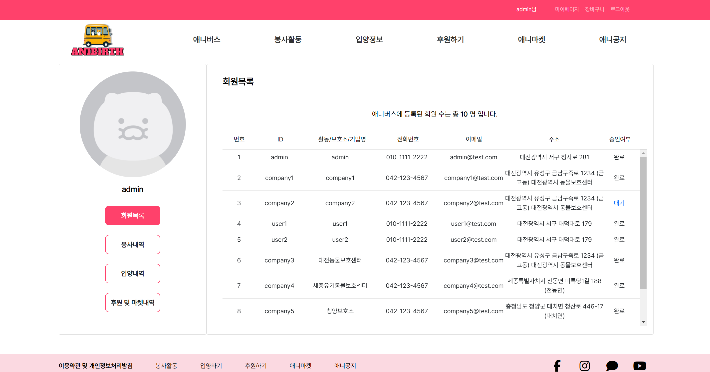 |
| 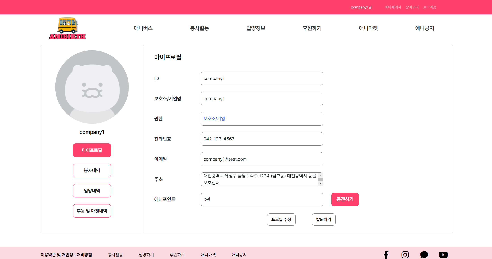  |
| 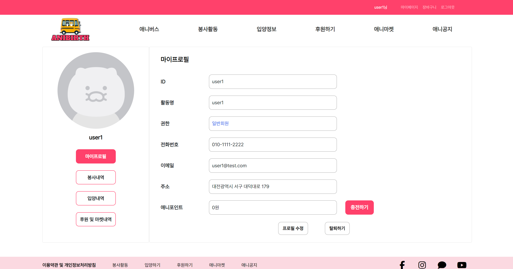  |

<br>

### [로그아웃]
- 상단 헤더의 로그아웃 버튼을 클릭하면 로그아웃과 동시에 메인페이지로 이동합니다.

<br>

### [애니버스]
- 애니버스는 기업 소개 페이지로 애니버스의 어원과 개발자 소개 및 위 사이트의 목표와 개요를 설명합니다.

| 애니버스                                                          |
|---------------------------------------------------------------|
| 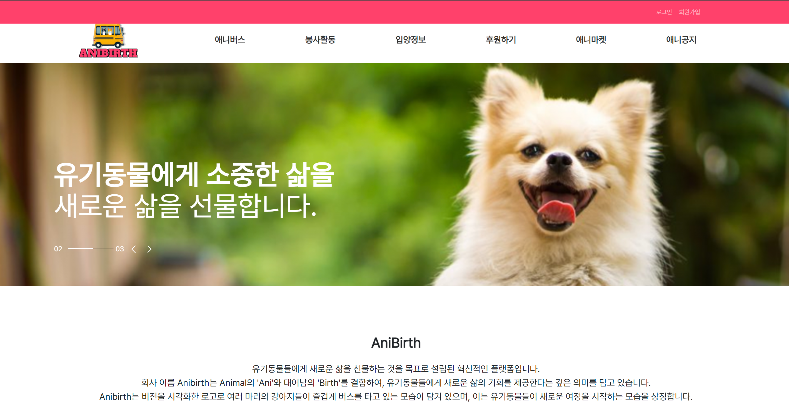 |

<br>

### [봉사활동]
- 봉사활동은 봉사활동과 봉사후기 두 가지의 소메뉴로 구분됩니다.
  - 봉사활동
    - 봉사활동은 사이트에 등록된 모든 봉사활동의 리스트를 보여주고, 캘린더를 통해 월간, 일간의 봉사활동을 한 눈에 확인할 수 있습니다.
    - 각 봉사활동의 사진이나 캘린더에서 일정을 클릭하면 해당 봉사활동의 상세보기 화면으로 이동이 가능합니다.
    - 상세보기 화면을 통해 일반 회원은 봉사활동 신청이 가능합니다.
    - 봉사활동은 로그인이 되어있을 때만 신청이 가능하며, 신청 시 신청 마감날짜가 지났거나 모집인원이 모두 채워졌을 경우 신청이 불가능합니다.
    - 봉사활동을 등록한 보호소/기업 회원 또는 최고 관리자는 신청인원보기를 통해 신청한 인원의 간단한 개인정보를 열람할 수 있습니다.
    - 봉사활동 등록과 수정, 삭제는 활동 글을 게시한 보호소/기업 회원 또는 최고 관리자에게만 권한이 있습니다.
  - 봉사후기
    - 봉사후기는 사이트에 등록된 모든 봉사후기의 리스트를 보여줍니다.
    - 봉사후기의 리스트를 클릭하면 해당 봉사후기의 상세보기 화면으로 이동이 가능합니다.
    - 상세보기 화면 내에서 버튼을 통해 이전, 다음글로 이동이 가능합니다.
    - 봉사후기 등록과 수정, 삭제는 후기 글을 게시한 회원에게만 권한이 있습니다.
    - 봉사후기 등록 시 대표 이미지를 제외하고 내용에 들어갈 첨부 이미지를 최대 3장까지 선택할 수 있습니다.

| 봉사활동                                                          |
|---------------------------------------------------------------|
| 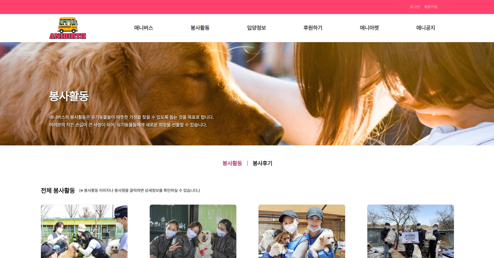 |
| 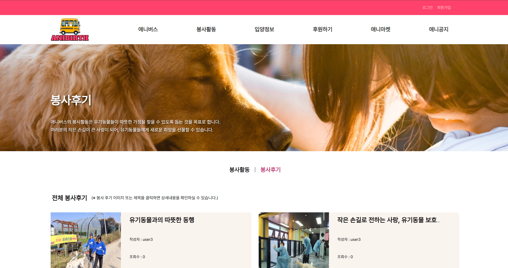 |

<br>

### [입양정보]
- 입양정보는 입양절차, 입양정보, 입양후기, 입양공고 작성 4가지 소메뉴로 구성됩니다.
    - 입양절차 
        - 입양절차는 입양정보 페이지 하단에 같이 위치해 있으며 입양절차 소메뉴를 클릭시
        - 페이지 하단으로 이동하여 입양절차에 대한 정보를 확인 할 수있습니다.
    - 입양정보
        - 입양절차는 사이트에 등록된 모든 유기동물의 리스트를 보여주고 카테고리 기능을 통해 조건에 맞는 유기동물을 검색 할 수있습니다.
        - 입양리스트에서 유기동물을 클릭 후 상세페이지로 이동하면 입양신청을 할 수 있습니다.
        - 입양신청페이지에서는 입양신청서 폼을 다운받아 작성해야하며 입양신청 유저에 대한 정보, 입양에 필요한 동의사항에 동의해야 합니다.
        - 입양신청에 대한 권한은 모든회원에게 있습니다.
    - 입양후기
        - 입양후기에서는 입양후기 리스트, 상세페이지, 입양후기 작성페이지가 구성되어 있습니다.
        - 입양후기 리스트에서는 모든 입양후기에 대한 정보가 나타납니다.
        - 상세페이지에서는 수정, 삭제 기능이 구현되어있습니다. 단 권한은 글을 작성한 회원에게만 있습니다.
        - 입양후기 작성페이지에서는 toast ui를 활용하여 게시글 작성페이지를 구현하였습니다.
        - 입양후기 작성권한은 입양을 한 회원에게만 있습니다.
    - 입양공고 작성
        - 입양공고 작성페이지는 입양동물을 등록할 수 있는 페이지로 등록에 필요한 정보들을 작성해야 합니다.
        - 입양공고 작성의 권한은 기업/동물센터 회원에게만 권한이 있습니다.
      
| 입양정보                                                          |
|---------------------------------------------------------------|
|    |
| 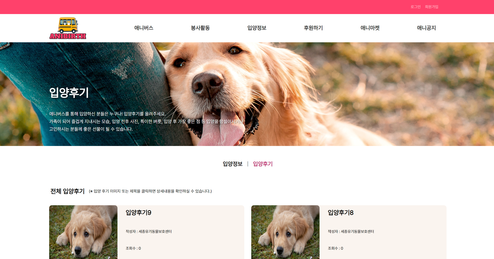 |

<br>

### [후원하기]
- 애니버스의 후원은 로그인한 사용자에 한해서만 후원이 가능합니다.
- 후원하기 클릭하면 후원 모달창 나옵니다.
- 후원은 애니버스에 가입한 보호센터 목록에서 지정하여 후원 할 수 있습니다. 
- 금액을 직접 입력하여 후원 할 수 있습니다.
- 후원을 하면 상위 3명의 리스트가 가장 많이 후원한 사람의 등 수로 업데이트 됩니다.

| 후원하기                                                        |
|-------------------------------------------------------------|
| 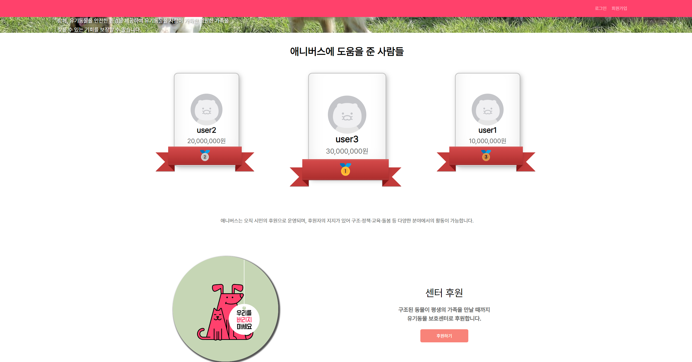 |

<br>

### [애니마켓]
- 애니마켓은 오픈형 마켓으로 보호소/기업 회원만이 자신들의 상품에 대해서 등록, 수정, 삭제 권한을 가지고 있습니다.
- 애니마켓는 비로그인 시에도 진입이 가능합니다.
- 장바구니, 리뷰는 오직 로그인 한 사용자에 한해서만 가능합니다.
- 이미지, 상품명, 가격을 클릭하면 상품 상세 페이지로 이동 할 수 있습니다.
- 상세 페이지에서 상품의 상세 정보 및 설명을 확인 할 수 있고 장바구니 담기와 리뷰를 작성할 수 있습니다.
- 최초 애니마켓 메뉴에 진입하게 되면 평점이 가장 높은 순서로 BEST 8개의 상품을 리스트하여 나열합니다.
- 전체상품보기 버튼을 통해 마켓에 등록된 모든 상품의 리스트를 볼 수 있습니다.
- 상품 리스트는 전체, 식료품, 액세서리로 카테고리가 구분되어 있습니다.
- 신상품순, 높은/낮은 가격순, 별점순, 조회순을 통해 상품 리스팅 필터도 가능합니다.
- 각 상품 리스트의 사진이나 상품명, 가격을 클릭하면 해당 상품의 상세보기 화면으로 이동이 가능합니다.
- 상품의 상세보기 화면을 통해 개인 장바구니에 상품을 담을 수 있지만, 로그인이 되어있지 않다면 불가능합니다.
- 상품의 상세보기 화면을 통해 리뷰작성이 가능하며 별점과 내용을 작성할 수 있습니다. 로그인이 되어있지 않다면 작성은 불가능합니다.

| 애니마켓                                                          |
|---------------------------------------------------------------|
| 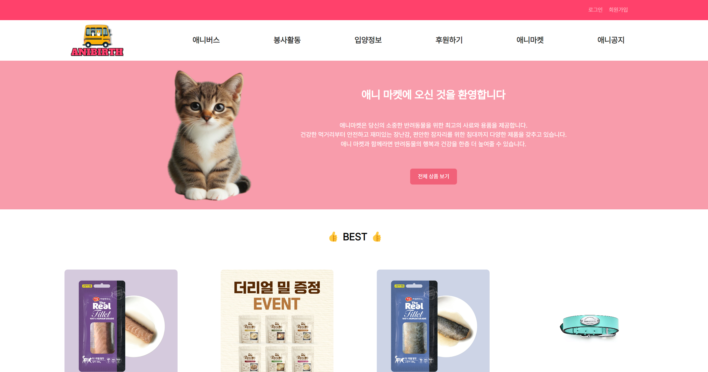 |

<br>

### [애니공지]
- 애니공지는 공지사항과 Q&A로 구분하고 있습니다.
- 공지사항은 애니버스 최고관리자만 등록, 수정, 삭제를 할 수 있습니다.
- 공지사항의 목록은 번호, 제목, 작성일, 조회수,관리(최고관리자만)로 표시됩니다.
- 공지사항의 상세페이지는 제목과 정보, 내용으로 표시되고 페이네이션으로 이전/다음 공지사항을 확인할 수 있습니다.
- Q&A는 중간관리자(기업, 보호소) 및 최고관리자만 질문에 답변할 수 있습니다.
- Q&A는 로그인한 모든 회원이 질문을 등록할 수 있습니다.
- Q&A는 자주 찾는 질문과 사용자가 등록한 질문의 목록으로 표시됩니다.
- 자주 찾는 질문의 제목을 클릭 시 질문의 답변이 제목의 하단에 표시되어 자주 찾는 질문의 내용을 간편하게 확인 할 수 있습니다.
- Q&A는 중간관리자(기업, 보호소) 및 최고관리자만 질문에 답변할 수 있습니다.
- Q&A은 로그인한 모든 회원이 질문을 등록할 수 있습니다.
- 질문은 번호, 제목, 작성자, 작성일, 조회수 표시 됩니다.
- 제목을 클릭하면 질문의 상세 페이지로 이동합니다.
- 질문의 상세페이지는 제목과 정보, 내용으로 표시되고 페이네이션으로 이전/다음 질문을 확인할 수 있습니다.

| 애니공지                                                          |
|---------------------------------------------------------------|
| 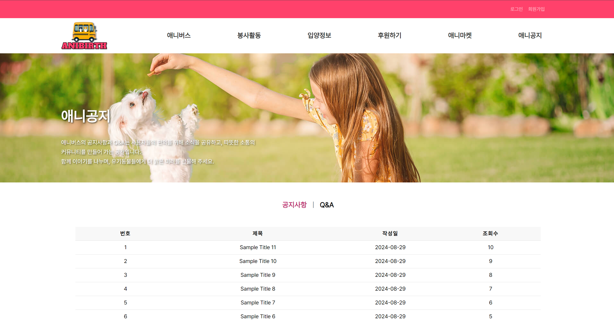 |

<br>

### [장바구니 및 결제]
- 장바구니에 담긴 상품 목록을 상품 이미지, 이름, 가격, 수량 등의 세부정보와 함께 표시합니다.
- 사용자는 품목을 선택/선택 취소하고, 수량을 직접 업데이트하고, 장바구니에서 품목을 삭제할 수 있습니다.
- 사용자가 장바구니 기능 수행 시(항목 선택/선택 취소, 수량 변경) 실시간으로 선택한 항목의 총 가격을 계산합니다.
- 결제하기 버튼을 이용하면 선택한 상품을 결제를 진행 할 수 있습니다.
- 결제하기는 결제(checkout)페이지로 이동합니다.
- 결제는 상품정보(상품명, 수량, 가격)으로 표시됩니다.
- 배송지정보(받는사람, 주소, 전화번호)로 로그인한 회원의 기본 정보로 표시 됩니다. 
- 결제가격(상품가격, 배송비, 합계)로 상품가격과 배송비가 합한 합계로 표시 됩니다.
- 포인트로 결제하기 버튼을 누르면 포인트가 차감됩니다.
- 결제는 포인트 충전 후 이용할 수 있습니다.

| 장바구니 및 결제                                                     |
|---------------------------------------------------------------|
| 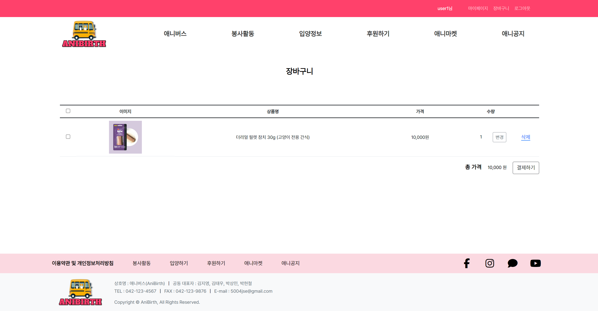 |
| 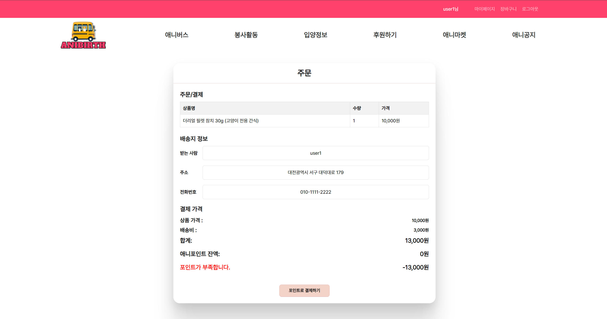   |

<br>

## 💥 트러블 슈팅
<details>
<summary> ❗박상민 </summary>

#### <1> <b>캘린더에서 상세페이지로 이동</b>

```문제``` FullCalendar를 사용하여 봉사활동의 전체 스케줄을 캘린더 일정에 표시하는데는 문제가 없었지만, 캘린더에 표시된 각 스케줄을 클릭했을 때 해당 상세페이지로 이동하지 않는 문제가 발생하였다.
</br></br>
```해결``` Calendar 엔티티에 어떤 봉사활동의 캘린더인지 @OneToOne 어노테이션을 사용하여 volunteer_id 외래키를 생성하고, FullCalendar 라이브러리의 특성상 객체를 JSON으로 직렬화하거나 JSON에서 역직렬화할 때 volunteer_id를 무시하도록 @JsonIgnore 어노테이션을 사용하였다.
추가로 봉사활동의 캘린더를 보여주는 JavaScript인 list.js에서 `url: event.volunteer ? /volunteer/detail/${event.volunteer.id} : null` 와 같이 주소를 매핑하여 문제를 해결하였다.
</br></br></br>

#### <2> <b>애니마켓에서 별점순으로 필터링</b>

```문제``` 애니마켓의 BSET 상품은 각 상품의 별점의 평균이 높은 순서로 8개를 추출하여 보여주는데, 엔티티 설계 시 Product 엔티티에는 별점과 관련된 컬럼이 들어가있지 않고, 각 상품의 리뷰인 Review 엔티티에 starRating 이라는 별점을 나타내는 컬럼이 있어서 단번에 별점 높은 순서의 상품을 추출하는데 문제가 발생하였다.
</br></br>
```해결``` getTopRatedProducts(8) 이라는 ProductService의 메서드를 이용하여 평균 별점이 가장 높은 8개의 상품을 추출하도록 하였고, ProductRepository에서 쿼리를 과 같이 `@Query(value = "SELECT p.* FROM product p JOIN review r ON p.id = r.product_id GROUP BY p.id ORDER BY AVG(r.star_rating) DESC, RAND() LIMIT :limit", nativeQuery = true)` 를 작성하여 Product와 Reivew를 조인하였고, 만약 동일 별점이면 랜덤으로 나타나도록 문제를 해결하였다.
</br></br></br>
</details>

<details>
<summary> ❗김지영 </summary>

#### <1> <b>Swiper 슬라이더의 반응형 이슈</b>

```문제``` Swiper 슬라이더가 반응형 디자인에서 제대로 동작하지 않는 문제가 발생했다. 화면 크기에 따라 슬라이더의 레이아웃과 기능이 불안정하거나 깨지는 현상이 발생하고 작은 화면에서 슬라이더의 높이, 이미지 비율, 텍스트 위치, 버튼 및 페이지네이션의 위치와 스타일이 엉키는 문제
</br></br>
```해결``` 슬라이더의 기본 높이와 너비를 설정하고, 화면 크기에 따라 동적으로 조정하도록 미디어 쿼리를 사용했다. 
이미지가 슬라이더 박스를 완전히 채우도록 object-fit 속성을 사용하고 슬라이더의 이전/다음 버튼 및 페이지네이션의 크기와 위치를 모바일 화면에 맞게 조정
</br></br></br>

#### <2> <b>댓글 폼 및 AJAX 요청</b>

```문제``` 게시물 상세 페이지에서 댓글을 추가하거나 삭제할 때 AJAX 요청과 댓글 폼이 올바르게 작동하지 않는 문제
</br></br>
```해결``` 댓글 폼의 submit 이벤트에서 AJAX 요청을 보내는 코드가 올바르게 작동하는지 확인하고, 응답으로 받은 댓글 ID를 기반으로 페이지를 새로 고치거나 댓글이 추가된 위치로 스크롤 이동
xhr.onload 함수 내에서 xhr.responseText로 댓글 ID를 처리하며, 서버 응답이 성공적인지 검증
폼 유효성 검사: 댓글 폼의 입력 값이 유효한지 확인하고, 빈 입력이나 잘못된 데이터가 서버로 전송되지 않도록 했다.
필수 입력 필드를 required 속성으로 설정하여 사용자 입력을 강제한다.
댓글 추가 후 페이지를 새로 고치면서 댓글 ID를 URL에 포함시켜 해당 댓글로 스크롤 이동했다.
</br></br></br>
</details>

<details>
<summary> ❗김태우 </summary>

#### <1> <b>toast ui 적용 오류</b>

```문제``` toast ui 활용시 제대로 된 form양식이 적용되지 않았으며 그 후에도 이미지 업로드시 base64 형식으로 저장되는점 등등의 여러 문제가 발생하였다. 
</br></br>
```해결``` 양식을 적용하기 위해 구글링을 하면서 editor 구성에 대한 정보를 검색해 script를 구성하였고
그리고 나서 글쓰기 페이지에 toast ui가 적용되었지만 이미지 업로드 시에 base64형식으로 파일이 저장되어
상세페이지에 이미지가 나타나지 않았고 hooks: {
async addImageBlobHook(blob, callback) { const filename = await response.text();
const imageUrl = `/gen/${filename}`;
callback(imageUrl, "image alt attribute");
}
이와같은 코드를 적용시켜 블롭형식으로 파일저장시 이름을 바꾸어주었다.
</br>

#### <2> <b>공공데이터 API 활용</b>

```문제``` 공공데이터 API를 활용하여 입양리스트를 구성하며 json방식이 아닌 xml방식으로만 가져올 수 있어서 문제가 생겼다.
</br></br>
```해결``` xml 방식으로 데이터를 가져오다 보니 정보를 읽어드리고 가져올 수 있는 수에서 에러가 발생했고 이를<br> 
String json = XmlToJsonConverter.convert(xml);
System.out.println("JSON Response: " + json); </br>
json형식으로 변환후 db에 저장시키며 데이터를 활용할 수 있었다
</br></br></br>

#### <3> <b>카테고리 활용</b>

```문제``` 공공데이터 API를 활용하면서 카테고리를 모든 정보에 적용 시킬 수 없었고 상위,하위 카테고리로 구성하여 문제가 복잡하였다.
</br></br>
```해결``` jpa를 사용하여 카테고리 선택 시 조건에 맞는 데이터를 가져오려 했지만 animal엔티티에 카테고리 기능을 연결시키는 어려움이 있었고
@Query("""</br>
SELECT a FROM Animal a</br>
WHERE (:kw IS NULL OR a.species LIKE CONCAT('%', :kw, '%'))</br>
AND (:classification IS NULL OR a.classification LIKE CONCAT('%', :classification, '%'))</br>
AND (:gender IS NULL OR a.gender LIKE CONCAT('%', :gender, '%'))</br>
AND (:weight IS NULL OR a.weight LIKE CONCAT('%', :weight, '%'))</br>
AND (:age IS NULL OR a.age LIKE CONCAT('%', :age, '%'))</br>
""")</br>
쿼리문을 활용해 직접적으로 조건에 맞는 데이터를 각 카테고리의 name과 연결시켜 검색되도록 하였다
</br></br></br>
</details>

<details>
<summary> ❗박현철 </summary>

#### <1> <b>CSRF 토큰 오류</b>

```문제``` csrf token forbidden(403)오류로 인해 후원 기능 사용 시에 일시적인 오류가 나고 새로고침 하면 정상작동하는 문제가 발생하였다. 코드에서 문제점을 찾을 수 없었기에 간단한 방법으로 해결하였다.
</br></br>
```해결``` 후원 기능에 csrf.token 기능을 빼고 SecurityConfig 에서도 csrf를 사용하지 않고 로그인한 사용자에게만 후원하기 버튼이 보일 수 있도록 수정하여 해결하였다.
</br></br></br>
</details>

## 🫸 개선해야 할 점

- 중복되는 코드 제거
    - layout.html 이라는 공통된 템플릿을 두고 사용하다보니 각 html에 대한 css을 작성할 때 혹시라도 겹치는 클래스명이나 태그가 있으면 서로 css 적용이 안되는 경우가 있었습니다.
    - 하나의 기능을 위해서 각 컨트롤러에서 중복된 코드를 사용한 경우가 있는데 프로그램의 속도 향상을 위해 코드를 간소화할 방법을 찾아봐야 할 것 같습니다.

<br>

## 🧑‍🎓 프로젝트를 마치며..

### 🍋‍🟩 박상민
처음 프로젝트를 다같이 기획할 때 주어진 시간에 비해서 많은 양의 기능을 소화해보고자 욕심을 냈던 것 같습니다.
하지만 팀원 모두가 팀 프로젝트의 경험이 있다보니 깃허브와 같은 협업의 과정에서 크게 시간을 낭비하지 않고 오로지 자신이 맡은 기능 역할에만 몰두할 수 있어
진행 속도가 굉장히 빠르다고 체감되었습니다. 그 덕분에 제가 맡은 부분은 비교적 빠르게 끝낼 수 있었고, 시간적으로 여유가 있어 조장으로서 팀원들이 구현한 기능과 UI를 조금 더 자세히 검토할 수 있었습니다.
부족한 부분은 같이 채워나가고 오히려 제가 놓친 부분도 피드백 받으며 원팀이 되어가는 모습이 한없이 뿌듯했습니다.
이번 프로젝트에선 Docker와 Jenkins를 이용한 서버 배포를 처음으로 진행해봤는데 쉽지 않을거라 예상은 했지만 너무 예상대로 어려워서 애를 먹었던 기억이 있습니다.
결론적으로는 배포에 문제없이 서버 구축과 세팅은 잘 마무리하였지만 아직 많이 부족하다 생각이 들어 앞으로 계속 학습하고 익혀야 될 숙제라고 생각이 듭니다.
약 2달동안 팀 프로젝트를 진행하면서 스스로 실력이 많이 늘었다라는 자신감에 코딩하는 게 행복할 때도 있었고, 생각만큼 되지않아 고민도 했었지만 역시 웹 개발자는 보여지는 화면을 봤을 때 그 희열이 배가 된다고 생각이 듭니다.
너무나도 믿음직스럽고 실력좋은 팀원들을 만나 감사했고 좋은 퀄리티의 사이트를 제작하느라 뿌듯합니다. 모두 고생하셨습니다!!

<br>

### 🐶 김지영
최종 프로젝트를 기획하면서 약 2달도 안되는 기간에 다 할 수 있을까 라는 걱정이 있었습니다. 
또한, 실력 좋은 팀원들에게 짐이 될 까봐 약간은 무거운 마음으로 프로젝트를 시작했습니다. 
프론트를 하면서 디자인이 제 마음에 충족이 되지 않았지만 어떻게 더 발전시켜야 하는지 모르겠어서 답답하기도 했습니다. 
그래서 다른 사이트들을 찾아 보며 UI를 어떤 식으로 구성해야 하는지 조금씩 알아갔습니다.
만들면서도 추가해야 하는 기능들도 계속 생겨나면서 우리가 사용하는 웹 사이트에는 생각보다 많은 기능들이 들어 있다는 것을 깨달았습니다.
막힐 때가 많았지만 하나씩 풀어갈 때마다 재미를 느낄 수 있었고, 눈 앞에 결과물을 바로 볼 수 있다는 것이 개발의 매력이라고 생각했습니다.
팀원들에게 어려움이 생길때마다 항상 달려가 도움을 주는 우리 조장님에게 많은 것을 배울 수 있었습니다. 기능을 만들때 조장님에게
더 효율적으로 코드를 짜는 방법과 디자인에 대한 피드백을 주셔서 성장할 수 있었습니다.
혼자서는 못했을 프로젝트를 좋은 팀원들과 같이 할 수 있어서 영광이였습니다. 다들 감사합니다 !


<br>

### 🚌 김태우
프로젝트를 시작하며 주제선정만 잘되면 이후에 일들은 나아가는데 문제가 없을거라 생각했습니다.
그래서 주제선정에 소요되는 시간이 오래걸리지 않을까 생각했지만 생각보다 빠르게 주제를 선정할 수 있었고
프로젝트 계획서를 작성하며 기능 및 UI에 대해 정리할 때 욕심이 생겼습니다.
계획한 내용대로 페이지를 구성하는데 조원들과 역할 분담부터 마무리까지 해야할 게 많은게 아닐까라는 걱정도 있었지만
조원모두 팀 프로젝트의 경험이 있다보니 각자의 맡은 역할을 수행하는데 문제가 생겨도 빠르게 해결해 나가며
프로젝트를 진행할 수 있었고 특히 이전에 협업하며 문제를 겪었던 git 배포 부분에서 문제가 많이 발생하지 않았습니다.
조원 모두 처음 시도해보는 기능들이 있었음에도 원활하게 기능을 구현해서 뿌듯했고 UI를 구성하는데 아직은
부족한 점이 많지만 저번보다 실력을 향상 시킬 수 있었다고 느껴서 만족스러웠습니다.
마지막으로 각자 맡은 일들을 해결해 나가는데 시간이 없음에도 서로 문제가 생기거나 부족한 점이 있을떄
다양한 의견을 내주고 피드백 하며 프로젝트를 완성한 조원들에게 감사합니다.

<br>

### 👑 박현철
초반에는 할 수 있을까 라는 막연한 고민을 안고 시작하였습니다. 그래도 6개월 동안의 시간에서 실력이 늘면서 이 프로젝트에 열심히 참여할 수 있었고
실력 좋은 팀원들을 만나 팀원들의 코드를 참고하며 부족한 부분은 팀원들에게 조언을 구하고
도움을 받으며 해결해 나갈 수 있었습니다. 이번 프로젝트를 하면서 프론트 면에서 많이 부족하다는걸
느꼈고 더 노력해야겠다고 생각했습니다. 부족하거나 추가해야하는 부분이 있으면 짚어주고 더 잘할 수 있게 이끌어준 조장님과
모르는게 있을 때 옆에서 도와주고 같이 아이디어를 생각해준 팀원들에게 감사하고 좋은 의미와 퀄리티 있는 사이트를 제작 할 수 있어서
의미 있는 시간이 되었습니다. 팀원들 모두 고생하셨습니다.^0^!


## 🔗Link

[프로젝트 완성 및 시연 영상](https://youtu.be/mQ1BB95RSgE)