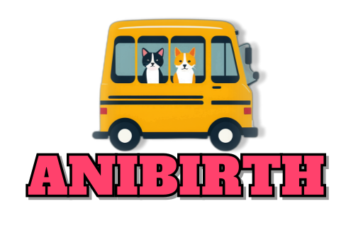
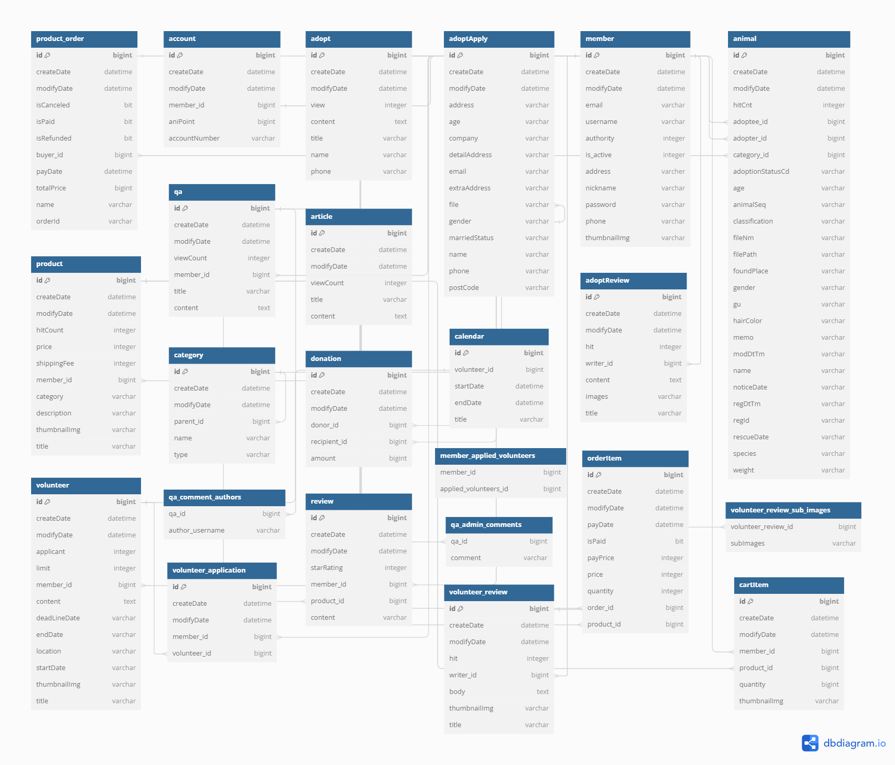
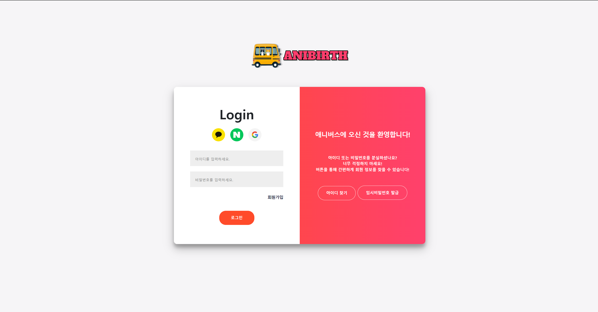

# 

## 🚀프로젝트 명 : AniBirth(애니버스)
- 웹 URL : www.anibirth.shop
- DB PORT : 3306
- DB username : root
- 데이터베이스 이름 : anibirth_dev

## 📢 프로젝트 목표
- 유기동물의 삶의 질 개선 및 입양률 상승
- 후원을 통한 유기동물 보호소에 대한 관심도 상승과 지원 강화
- 유기동물 봉사를 통한 유기동물들의 건강과 복지 증진
- 유기동물 문제에 대한 인식 높이기

## ⏱️개발 기간
- 전체 개발 기간 : 2024-07-15 ~ 2024-09-02
- 프로젝트 주제 선정 기간 : 2024-07-15 ~ 2024-07-19
- UI 구현 : 2024-07-20 ~ 2024-09-02
- 기능 구현 : 2024-07-20 ~ 2024-09-02

## ⚙ 개발 환경
- 운영체제 : Windows 11
- 통합개발환경(IDE) : IntelliJ
- JDK 버전 : JDK 17
- 데이터 베이스 : MySQL
- 빌드 툴 : Gradle
- 관리 툴 : GitHub


## 🔌 Dependencies
- Spring Boot DevTools
- Lombok
- Spring Data JPA
- MariaDB Driver
- Spring Security
- Spring Web
- Oauth2-client
- Thymeleaf
- Validation
- Jackson (공공데이터 OpenAPI)
- Toss Payments
- FullCalendar
- Kakao Maps


## 💻 기술 스택
- 백엔드
    - SpringBoot, Spring Security, Spring Data JPA
- 프론트엔드
    - HTML, CSS, Javascript, Bootstrap, Thymeleaf, jQuery, Tailwind
- 데이터베이스
    - MariaDB, MySQL Workbench
    - MySQL, SQLyog, DBeaver

## 🛠 DB 테이블 설계
- Member (회원)
- account (계좌)
- adopt (입양)
- adoptApply (입양신청)
- adoptReview (입양후기)
- animal (유기동물)
- article (공지사항)
- calendar (캘린더)
- cartItem (장바구니)
- category (동물 카테고리)
- donation (후원)
- member_applied_volunteers (봉사 신청 회원)
- orderItem (주문)
- product (상품)
- product_order (결제내역)
- qa (게시판 질문사항)
- qa_admin_comments (게시판 답변)
- qa_comment_authors (게시판 댓글 작성자)
- review (상품 리뷰)
- volunteer (봉사활동)
- volunteer_application (봉사활동 신청 회원)
- volunteer_review (봉사활동 후기)
- volunteer_review_sub_images (봉사활동 후기 첨부 사진)

<br>

| E-R 다이어그램                                                     |
|---------------------------------------------------------------|
|  |

<br>

## 👨‍👩‍👧‍👦 조원 소개

<div align="center">

|                                                           **박상민 (조장)**                                                            |                                                               **김지영**                                                                |                                                             **김태우**                                                              |                                                                **박현철**                                                                |
|:---------------------------------------------------------------------------------------------------------------------------------:|:------------------------------------------------------------------------------------------------------------------------------------:|:--------------------------------------------------------------------------------------------------------------------------------:|:-------------------------------------------------------------------------------------------------------------------------------------:|
| [ <br/> @psm817](https://github.com/psm817) | [ <br/> @jiyoung-0y0](https://github.com/jiyoung-0y0) | [ <br/> @taewoo922](https://github.com/taewoo922) | [ <br/> @2251341](https://github.com/2251341) |

</div>

## 🧑‍🏫 역할 분담

### 🍋‍🟩 박상민 (조장)

- **UI**
  - 페이지 : 메인페이지, 로그인, 회원가입, 마이페이지, 봉사활동, 애니마켓
- **기능**
  1. 서버 배포
     - 네이버 클라우드 플랫폼을 이용하여 서버 생성
     - Docker 이미지 생성을 통해 서버 배포 완료
     - 젠킨스를 통한 CI/CD 배포 자동화 세팅
  2. 회원 (로그인, 회원가입, 마이페이지)
     - 일반 회원 및 카카오, 네이버, 구글을 통한 소셜 로그인 구현
     - 아이디 찾기, 임시 비밀번호 발급 구현 (이메일 발송)
     - 회원가입 구현
     - 마이페이지를 통한 회원 정보 열람, 프로필 수정, 회원 탈퇴 구현
  3. 메인페이지
     - 봉사활동 요약 기능 구현
     - 유기동물 공고 요약 기능 구현
     - 애니마켓 베스트 상품 요약 기능 구현
     - 공지사항, 봉사후기, 입양후기, 바로가기 버튼 구현
  4. 봉사활동
     - 봉사활동 등록, 수정, 삭제 구현
     - 봉사활동 전체 리스트와 상세보기 구현
     - 봉사활동 상세보기 중 봉사 장소에 대한 지도 표시 구현
     - 봉사활동 신청 구현
     - 등록된 각각의 봉사활동을 캘린더에 표시되도록 구현
     - 봉사활동 후기 등록, 수정, 삭제 구현
  5. 애니마켓
     - 마켓 상품 등록, 수정, 삭제 구현
     - 마켓 상품에 대한 리뷰 등록, 수정, 삭제 구현
     - 마켓 상품 전체 리스트와 상세보기 구현
     - 마켓 내 카테고리 구분 (식료품, 액세서리)
     - 신상품순, 높은(낮은)가격순, 별점순, 조회순으로 리스트 구현
<br>

### 🐶 김지영

- **UI**
  - 페이지 : 
- **기능**
  - a

<br>

### 🚌 김태우

- **UI**
  - 페이지 : 
- **기능**
  - a

<br>

### 👑 박현철

- **UI**
  - 페이지 : 
- **기능**
  - a

<br>

## 📝 프로젝트 전체 구조

```
├── README.md
├── build.gradle
├── .gitignore
├── gradlew.bat
├── gradlew
│
└── src.main
     ├── java.com.cod.AniBirth
           ├── AniBirthApplication.java
           ├── AniBirth
                  ├── account
                          ├── entity.Account.java
                          ├── repository.AccountRepository.java
                          ├── service.AccountService.java
                  ├── adopt
                        ├── controller.AdoptController.java
                        ├── entity
                               ├── Adopt.java
                               ├── AdoptApply.java
                               ├── AdoptReview.java
                        ├── form
                              ├── AdoptForm.java
                              ├── AdoptionnoticeForm.java
                              ├── createReviewForm.java
                        ├── repository
                                 ├── AdoptApplyRepository.java
                                 ├── AdoptRepository.java
                                 ├── AdoptReviewRepository.java
                        ├── service
                                ├── AdoptReviewService.java
                                ├── AdoptService.java
                  ├── animal
                        ├── contorller.AnimalController.java
                        ├── entity.Animal.java
                        ├── repository.AnimalRepository.java
                        ├── service.AnimalService.java
                        ├── AnimalSearchDTO.java
                        ├── AnimalSpecification.java
                  ├── article
                        ├── contorller.ArticleController.java
                        ├── contorller.QaController.java
                        ├── entity.Article.java
                        ├── entity.Qa.java
                        ├── repository.ArticleRepository.java
                        ├── repository.QaRepository.java
                        ├── service.ArticleService.java
                        ├── service.QaService.java
                  ├── base
                        ├── entity.BaseEntity.java
                        ├── WebMvcConfig.java
                  ├── calendar
                        ├── contorller.CalendarController.java
                        ├── entity.Calendar.java
                        ├── repository.CalendarRepository.java
                        ├── service.CalendarService.java
                  ├── cart
                        ├── contorller.CartController.java
                        ├── entity.CartItem.java
                        ├── repository.CartRepository.java
                        ├── service.CartService.java
                  ├── category
                        ├── contorller.CategoryController.java
                        ├── entity.Category.java
                        ├── repository.CategoryRepository.java
                        ├── service.CategoryService.java
                        ├── CategoryInitializer.java
                  ├── donation
                        ├── contorller.DonationController.java
                        ├── entity.Donation.java
                        ├── repository.DonationRepository.java
                        ├── service.DonationService.java
                  ├── email
                        ├── service.EmailService.java
                  ├── global
                        ├── initData.Dev.java
                        ├── Message.Message.java
                        ├── security
                                ├── exception.MemberNotFoundException.java
                                ├── exception.OAuthTypeMatchNotFoundException.java
                                ├── CustomAuthenticationFailureHandler.java
                                ├── CustomUserDetailsService.java
                                ├── DataNotFoundException.java
                                ├── MemberContext.java
                                ├── OAuth2UserService.java
                                ├── SecurityConfig.java
                                ├── UserNotActiveException.java
                  ├── home
                        ├── contorller.HomeController.java
                        ├── contorller.IntroduceController.java
                  ├── member
                        ├── contorller.MemberController.java
                        ├── contorller.MyPageMemberController.java
                        ├── contorller.UsernameCheckController.java
                        ├── entity.Member.java
                        ├── form.MemberForm.java
                        ├── repository.MemberRepository.java
                        ├── service.MemberService.java
                  ├── order
                        ├── contorller.OrderController.java
                        ├── entity.Order.java
                        ├── entity.OrderItem.java
                        ├── repository.OrderItemRepository.java
                        ├── repository.OrderRepository.java
                        ├── service.OrderService.java
                  ├── point
                        ├── contorller.PointController.java
                        ├── service.PointService.java
                  ├── product
                        ├── contorller.ProductController.java
                        ├── entity.Product.java
                        ├── repository.ProductRepository.java
                        ├── service.ProductService.java
                  ├── review
                        ├── contorller.ReviewController.java
                        ├── entity.Review.java
                        ├── repository.ReviewRepository.java
                        ├── service.ReviewService.java
                  ├── volunteer
                        ├── contorller.VolunteerController.java
                        ├── entity.Volunteer.java
                        ├── entity.VolunteerApplication.java
                        ├── entity.VolunteerReview.java
                        ├── repository.VolunteerRepository.java
                        ├── repository.VolunteerApplicationRepository.java
                        ├── repository.VolunteerReviewRepository.java
                        ├── service.VolunteerService.java
                        ├── service.VolunteerApplicationService.java
                        ├── service.VolunteerReviewService.java
                  ├── ApiExploer.java
                  ├── ApiResponse.java
                  ├── XmlToJsonConverter.java
           ├── global
                  ├── util
                        ├── HtmlUtils.java
                        ├── Util.java
    ├── resource
            ├── static
                   ├── adopt
                          ├── 입양신청서폼.docx
                          ├── 카테고리.svg
                   ├── images
                          ├── 샘플데이터 사진 및 프로젝트 로고 사진
                   ├── javascript
                          ├── adopt
                                ├── zipcode.js
                          ├── article
                                ├── detail.js
                          ├── commont
                                ├── common.js
                          ├── donation
                                ├── donationscript.js
                          ├── home
                                ├── main.js
                          ├── member
                                ├── myProfile.js
                                ├── agreement.js
                                ├── login.js
                                ├── modify.js
                                ├── signup.js
                                ├── social_modify.js
                          ├── product
                                ├── create.js
                                ├── detail.js
                          ├── qa
                               ├── list.js
                          ├── volunteer
                                  ├── create.js
                                  ├── detail.js
                                  ├── list.js
                                  ├── reviewCreate.js
                   ├── resource
                         ├── adopt
                                ├── apply.css
                                ├── create_review.css
                                ├── detail.css
                                ├── list.css
                                ├── review.css
                                ├── review_detail.css
                         ├── article
                                ├── detail.css
                                ├── form.css
                                ├── list.css
                         ├── common
                                ├── common.css
                         ├── donation
                                ├── donationPage.css
                         ├── home
                               ├── main.css
                         ├── introduce
                                  ├── agreement.css
                         ├── member
                                ├── myPage
                                      ├── adopt.css
                                      ├── donation.css
                                      ├── market.css
                                      ├── myProfile.css
                                      ├── volunteer.css
                                ├── agreement.css
                                ├── login.css
                                ├── modify.css
                                ├── signup.css
                                ├── social_modify.css
                         ├── order
                               ├── checkout.css
                         ├── points
                                ├── recharge.css
                         ├── product
                                ├── accessory.css
                                ├── create.css
                                ├── detail.css
                                ├── food.css
                                ├── list.css
                                ├── main.css
                         ├── qa
                              ├── detail.css
                              ├── form.css
                              ├── list.css
                         ├── volunteer
                                  ├── create.css
                                  ├── detail.css
                                  ├── list.css
                                  ├── modify.css
                                  ├── review.css
                                  ├── reviewCreate.css
                                  ├── reviewDetail.css
                                  ├── reviewModify.css
            ├── templates
                    ├── adopt
                          ├── adoption_noticeForm.html
                          ├── create_review_form.html
                          ├── detail.html
                          ├── form.html
                          ├── list.html
                          ├── review.html
                          ├── review_detail.html
                    ├── article
                            ├── detail.html
                            ├── form.html
                            ├── list.html
                    ├── cart
                           ├── list.html
                    ├── donation
                           ├── donation.html
                    ├── home
                           ├── main.html
                    ├── introduce
                           ├── agreement.html
                           ├── anibirth.html
                    ├── layout
                          ├── layout.html
                    ├── member
                          ├── myPage
                                 ├── adopt.html
                                 ├── donation.html
                                 ├── market.html
                                 ├── myProfile.html
                                 ├── volunteer.html
                          ├── agreement.html
                          ├── login.html
                          ├── modify.html
                          ├── signup.html
                          ├── social_modify.html
                    ├── order
                          ├── checkout.html
                    ├── points
                          ├── recharge.html
                    ├── product
                          ├── accessory
                                  ├── high_hit.html
                                  ├── high_price.html
                                  ├── high_rating.html
                                  ├── low_price.html
                          ├── food
                                ├── high_hit.html
                                ├── high_price.html
                                ├── high_rating.html
                                ├── low_price.html
                          ├── list
                                ├── high_hit.html
                                ├── high_price.html
                                ├── high_rating.html
                                ├── low_price.html
                          ├── accessory.html
                          ├── create.html
                          ├── detail.html
                          ├── food.html
                          ├── list.html
                          ├── main.html
                          ├── modify.html
                    ├── qa
                         ├── detail.html
                         ├── form.html
                         ├── list.html
                    ├── review
                           ├── modify.html
                    ├── volunteer
                            ├── create.html
                            ├── detail.html
                            ├── list.html
                            ├── modify.html
                            ├── review.html
                            ├── reviewCreate.html
                            ├── reviewDetail.html
                            ├── reviewModify.html
                    ├── message.html
            ├── application.yml
            ├── application-dev.yml
            ├── application-prod.yml (배포용)
            ├── application-secret.yml (비공개)
            ├── application-secret.yml.default
            ├── application-test.yml (테스트용)
```

## 🧜‍♀️ 작업 관리 방법

- GitHub Projects와 Issues를 사용하여 진행 상황을 공유했습니다.
- 매일 본인의 작업 양을 소화하고 각자 구현한 기능을 서로 테스트하며 프로그램의 신뢰성을 높였습니다.

## ⭐ 페이지별 기능 소개

### [메인화면]
- 서비스 접속 초기화면으로 화면 페이지의 기본 구조는 상단 헤더, 중간 본문, 하단 플레이리스트로 구분되어 있습니다.
    - 상단 헤더는 '차트 목록', '커뮤니티', '스튜디오', '로그인', '회원가입' 메뉴가 구성되어 있습니다.
    - 상단 헤더에는 음악 제목에 대한 모든 검색이 가능한 검색창이 포함되어 있습니다.
    - 메인화면 중간 본문은 광고 및 홍보 배너와 최신 & 추천 음악, 자주 찾는 질문 & 인기 스튜디오가 나열되어 있습니다.
    - 하단 플레이리스트는 실제 회원이 담은 노래를 재생하는 플레이바입니다.
- 서비스 미로그인 시 진입을 제한한 메뉴가 존재합니다.
    - 로그인이 되어 있지 않은 경우 : 스튜디오, 곡 정보 열람 불가, 플레이리스트 재생 불가
    - 로그인이 되어 있는 경우 : 모든 메뉴 진입 가능

| 메인화면                                                          |
|---------------------------------------------------------------|
|  |

<br>

### [회원가입]
- 회원가입 버튼과 동시에 이용약관 및 개인정보 수집, 저작권 안내애 대한 동의서 제출이 요구됩니다.
- 약관동의의 동의 후 일반 회원가입을 진행합니다.
- 모든 항목에 대한 유효성 검사를 적용합니다.
- ID는 중복확인을 필수로, 비밀번호는 비밀번호 확인절차를 거칩니다.
- 프로필 사진을 선택하면 화면에서 예시된 이미지를 보여줍니다.
- 회원가입이 완료되면 로그인 화면으로 이동과 동시에 회원가입 시 입력한 이메일 주소로 환영 메일이 전송됩니다.

| 회원가입                                                               |
|--------------------------------------------------------------------|
|  |
|  |

<br>

### [로그인]
- ID와 PW를 통한 로그인을 수행합니다.
- 카카오, 네이버, 구글을 통한 소셜 로그인은 버튼을 눌러 각 플랫폼에 로그인하면 자동으로 계정 생성됩니다.
- 아이디 기억하기 체크박스를 통해 로그아웃 시에도 본인이 로그인했던 아이디를 기억합니다.
- 비밀번호 찾기를 통해 최초 회원가입 시 입력한 이메일 주소로 임시 비밀번호를 전송합니다.
- 로그인에 성공하면 메인페이지 화면으로 이동합니다.

| 로그인                                                          |
|--------------------------------------------------------------|
|  |

<br>

### [마이페이지]
- 로그인이 되어있는 사용자만 마이페이지에 진입할 수 있습니다.
- 회원의 ID, 닉네임, 이메일, 프로필사진 정보를 제공합니다.
- 회원탈퇴 버튼을 통해 실제 회원 탈퇴가 진행됩니다.
- 프로필 수정 버튼을 통해 ID를 제외한 모든 정보를 변경할 수 있습니다.
- 소셜로그인의 경우 프로필 수정은 닉네임과 프로필 사진만 가능합니다.
- 프로필 사진은 등록되지 않을 경우 기본 이미지가 등록됩니다.

| 마이페이지                                                          |
|----------------------------------------------------------------|
|  |

<br>

### [로그아웃]
- 상단 헤더의 로그아웃 버튼을 클릭하면 로그아웃과 동시에 메인페이지로 이동합니다.

| 로그아웃                                                          |
|---------------------------------------------------------------|
|  |

<br>

### [차트 목록]
- TOP100과 장르별 차트를 보여줍니다.
- TOP100은 음악의 좋아요(추천) 수가 많은 순서대로 나열됩니다.
- 장르별 차트는 음악의 장르별로 등록된 음악이 모두 나열됩니다.
- 로그인을 하지 않았을 때 TOP100에서 음악을 플레이리스트에 담을 수 없으며, 음악 추천도 불가능합니다.
- 로그인을 하였을 때 TOP100에서 음악을 플레이리스트에 담을 수 있습니다.
- 차트별 제목 또는 스튜디오를 클릭하면 해당 곡의 정보를 보여주는 스튜디오 페이지로 이동합니다.
- 듣기 버튼을 통해 회원 비회원 구분없이 1분 미리 듣기가 가능합니다.
- 장르별 차트에 있는 재생버튼 클릭 시 서클 웨이브가 작동합니다.

| 차트목록                                                               |
|--------------------------------------------------------------------|
|  |
|   |

<br>

### [전체 음악 검색]
- 상단 헤더바를 통해 전체 노래를 검색할 수 있습니다.
- 노래 검색은 곡 제목을 통해서만 가능하며 제목의 일부만 검색해도 해당 문자가 포함된 모든 결과를 화면에 보여줍니다.
- 차트목록과 마찬가지로 음악 상세 정보와 음악 담기가 가능하지만, 로그인이 되어있지 않았다면 모두 실행할 수 없습니다.

| 차트목록                                                              |
|-------------------------------------------------------------------|
|     |

<br>

### [플레이리스트]
- 차트목록에서 '담기' 버튼을 통해 개인 플레이리스트에 노래를 저장합니다.
- 플레이리스트에 순서는 담기 순서대로 위에서 아래로 나열됩니다.
- 재생 버튼을 통해 음악을 재생할 수 있으며, 이전곡과 다음곡 버튼을 통해 플레이리스트 컨트롤이 가능합니다.
- 반복 재생 버튼 클릭 시 음악 반복 재생이 가능합니다.
- 볼륨 버튼을 통해 볼륨 조절이 가능합니다.
- 실수로 음악을 잘못 담았다면 삭제 버튼을 통해 플레이리스트에서 해당 곡을 제외시킬 수 있습니다.

| 플레이리스트                                                          |
|-----------------------------------------------------------------|
|  |

<br>

### [커뮤니티]
- 커뮤니티의 분류는 공지, 자유, 친목 게시판으로 구분되어 있습니다.
- 커뮤니티는 로그인 여부와 관계없이 게시물 열람이 가능합니다.
- 최초 커뮤니티 진입 시 전체 게시판이 보여집니다.
- 관리자의 의해 작성된 공지사항이 커뮤니티 상단에 나열됩니다.
- 커뮤니티 좌측에는 로그인되어 있는 사용자의 기본 정보와 +프로필을 통해 커뮤니티 내에서 해당 회원이 활동한 이력을 한 번에 볼 수 있습니다.
- 로그인을 하지 않았을 때는 커뮤니티 좌측에 로그인 페이지와 연결된 버튼이 존재합니다.
- 커뮤니티 우측에는 현재 시간과 오늘 가장 인기있는 게시물 10개를 나열합니다.
- 로그인한 사용자는 본인 게시물의 한해서 작성, 수정, 삭제가 가능합니다.
- 관리자는 모든 회원 게시물에 삭제에 대한 권한을 가지고 있습니다.

| 커뮤니티                                                          |
|---------------------------------------------------------------|
|  |

<br>

### [스튜디오]
- 스튜디오는 오직 로그인한 사용자에 한해서만 진입이 가능합니다.
- 스튜디오 내에서 다른 회원의 ID 검색을 통해 타 스튜디오 방문이 가능합니다.
- 타 스튜디오 또는 내 스튜디오에서 방명록을 작성할 수 있습니다.
- 타 스튜디오 방문 시 내 스튜디오 가기 버튼을 통해 손쉽게 내 스튜디오로 돌아올 수 있습니다.
- 방명록 관리는 관리자와 해당 스튜디오 주인만 삭제가 가능합니다.
- 관리자에 의해서 각 회원의 스튜디오를 차단 또는 활성화할 수 있습니다.
- 스튜디오 차단 시 해당 스튜디오 주인을 포함한 모든 회원은 차단된 스튜디오를 방문할 수 없습니다.
- 스튜디오 활성화를 원할 땐 커뮤니티를 통해 문의를 해야합니다.
- 스튜디오 내 각 회원의 음악 등록, 수정, 삭제가 가능합니다.
- 음악 등록, 수정, 삭제는 스튜디오 주인과 관리자에게만 권한이 부여됩니다.

| 스튜디오                                                          |
|---------------------------------------------------------------|
|  |

<br>

## 💥 트러블 슈팅
<details>
<summary> 박상민 </summary>
    </br>

#### <1> <b>이미지 업로드</b>

```문제``` 이미지 업로드와 동시에 변환을 시키는데 경로 설정, 파일 변경, 전송 실패 등등.. 여러 문제가 발생하였다. 이미지 업로드 트러블을 해결하기 위해서 디버깅 및, 검색을 이용해 문제를 해결하였다.
</br>
```해결``` Ex )enctype="multipart/form-data" 문제나 public void addResourceHandlers(ResourceHandlerRegistry registry) 파일에서의 경로 설정 혹은, file handler에서의 파일 저장 방법 등.. 을 이용하여 여러 문제를 해결하였다.
</br>
</details>

<details>
<summary> 김지영 </summary>
    </br>

#### <1> <b>이미지 업로드</b>

```문제``` 이미지 업로드와 동시에 변환을 시키는데 경로 설정, 파일 변경, 전송 실패 등등.. 여러 문제가 발생하였다. 이미지 업로드 트러블을 해결하기 위해서 디버깅 및, 검색을 이용해 문제를 해결하였다.
</br>
```해결``` Ex )enctype="multipart/form-data" 문제나 public void addResourceHandlers(ResourceHandlerRegistry registry) 파일에서의 경로 설정 혹은, file handler에서의 파일 저장 방법 등.. 을 이용하여 여러 문제를 해결하였다.
</br>
</details>

<details>
<summary> 김태우 </summary>
    </br>

#### <1> <b>이미지 업로드</b>

```문제``` 이미지 업로드와 동시에 변환을 시키는데 경로 설정, 파일 변경, 전송 실패 등등.. 여러 문제가 발생하였다. 이미지 업로드 트러블을 해결하기 위해서 디버깅 및, 검색을 이용해 문제를 해결하였다.
</br>
```해결``` Ex )enctype="multipart/form-data" 문제나 public void addResourceHandlers(ResourceHandlerRegistry registry) 파일에서의 경로 설정 혹은, file handler에서의 파일 저장 방법 등.. 을 이용하여 여러 문제를 해결하였다.
</br>
</details>

<details>
<summary> 박현철 </summary>
    </br>

#### <1> <b>이미지 업로드</b>

```문제``` 이미지 업로드와 동시에 변환을 시키는데 경로 설정, 파일 변경, 전송 실패 등등.. 여러 문제가 발생하였다. 이미지 업로드 트러블을 해결하기 위해서 디버깅 및, 검색을 이용해 문제를 해결하였다.
</br>
```해결``` Ex )enctype="multipart/form-data" 문제나 public void addResourceHandlers(ResourceHandlerRegistry registry) 파일에서의 경로 설정 혹은, file handler에서의 파일 저장 방법 등.. 을 이용하여 여러 문제를 해결하였다.
</br>
</details>

## 🫸 개선해야 할 점

- 중복되는 코드 제거
    - layout.html 이라는 공통된 템플릿을 두고 사용하다보니 각 html에 대한 css을 작성할 때 혹시라도 겹치는 클래스명이나 태그가 있으면 서로 css 적용이 안되는 경우가 있었습니다.
    - 하나의 기능을 위해서 각 컨트롤러에서 중복된 코드를 사용한 경우가 있는데 프로그램의 속도 향상을 위해 코드를 간소화할 방법을 찾아봐야 할 것 같습니다.

- 차트 목록에서 음악 재생
    - 로그인 여부와 관계없이 차트목록에서 듣기 버튼을 누르면 해당 음악의 1분 미리듣기 서비스를 제공하지만 로그인이 되었을 때도 1분 미리듣기가 재생되고 있습니다.
    - 듣기 버튼을 누름과 동시에 개인 플레이리스트에 추가가 되고 전 곡 재생이 되도록 구현을 했어야하는 데 기간 내에 수행하지는 못했습니다. 해당 부분은 추후에 수정할 예정입니다.

<br>

## 🧑‍🎓 프로젝트를 마치며..

### 🍋‍🟩 박상민
내용작성

<br>

### 🐶 김지영
내용작성

<br>

### 🚌 김태우
내용작성

<br>

### 👑 박현철
내용작성


## 🔗Link

[프로젝트 완성 및 시연 영상](주소작성)